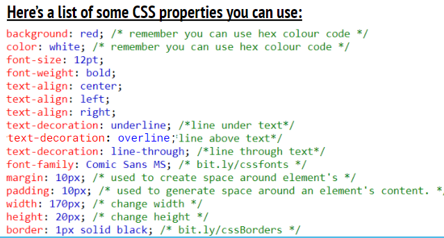

# 💻 Introduction to HTML and CSS 

You  will explore the two core languages that are used to build web pages; Hypertext Markup Language (HTML) and Cascading Style Sheets (CSS).

## ✅ Learning Outcomes: Exercise 1.4

> *By completing this exercise you will have experienced the following:*

* Change text decoration; underline, overline and line-through. 
* Change margins.
* Change border; size, style and colour. 

---

## 🎯 Exercise 1.4:  Poster

* You will be introduced to be introduced to more CSS properties allowing to customise your web page more. 

*  Using the **index.html** edit the code to create your very own poster, **be creative** 

🆘 **Use the CSS Code to help you **
)

---
Your final webpage should look something like this:

# ⏭️ Next Lesson
* In the next lesson you will about the importance of code being in order. As well as how HTML and CSS are connected.
  